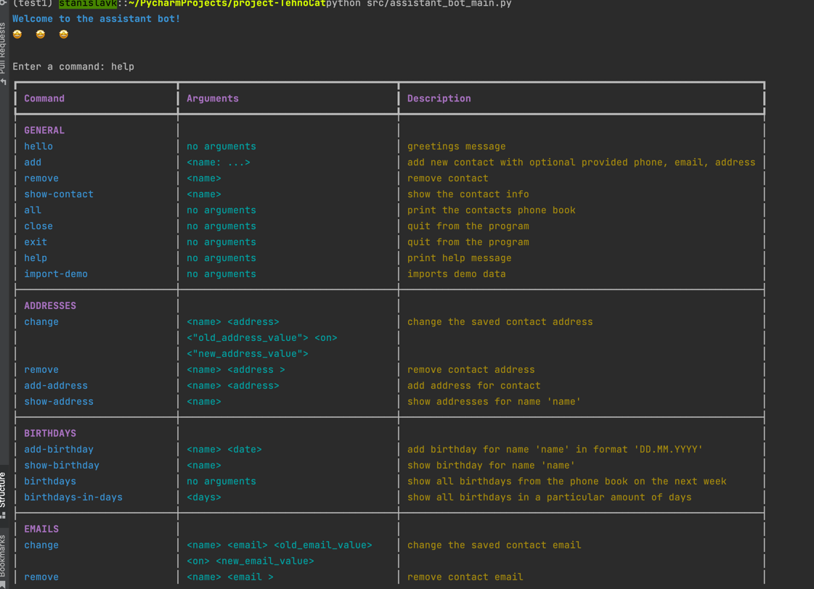

# Phone book assistant
## Installation from pip

```shell
pip install project_tehnocat
```
Now the assistant is available by typing `tehnocat`:
```shell
foo@bar:~$ tehnocat
Welcome to the assistant bot!
Enter a command: 
```
## Installation for development
1. Clone repository and move to the root:
```shell
git clone https://github.com/st3n/project-TehnoCat.git
cd project-TehnoCat
```
2. Create and activate venv
```shell
conda create -n <name_of_venv>
conda activate <name_of_venv>
```
3. Install package
```shell
pip install -e .
```
4. Now the assistant is available by typing `tehnocat`:
```shell
foo@bar:~$ tehnocat
Welcome to the assistant bot!
Enter a command: 
```

## Possible commands
use "help" command

